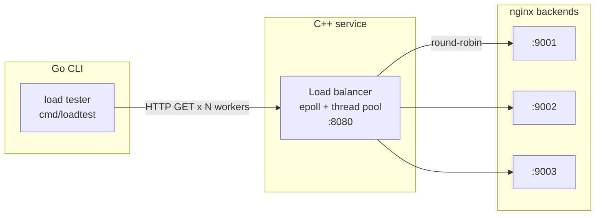

# Conduit

**A Layer 4 TCP load balancer written from scratch in C++, with a Go load-testing CLI that
drives traffic through it and reports latency percentiles and achieved throughput.**


No networking libraries and no load-testing frameworks — raw POSIX sockets and an `epoll`
event loop underneath, a hand-rolled metrics pipeline on top.

---

## Project status

The **load balancer** and the **CLI load tester** are the working, supported path. Run the
balancer, point the CLI at it, read the percentile table. That's the loop this repo is built
around today.

The **React dashboard** are a work in progress. The code for the go agent with websockets streaming is in `load-tester/` (root package) and a React client in `dashboard/` 

---

## Architecture



**Load balancer** (`load-balancer/`) — a Layer 4 TCP proxy built on raw POSIX sockets. A
non-blocking listener feeds an `epoll` event loop, which dispatches connection setup and
byte forwarding onto a thread pool sized to `std::thread::hardware_concurrency()`. Each
accepted client is paired with a backend chosen round-robin from a YAML config, and both
file descriptors are registered with the same event loop. No `libevent`, no framework.

**Load tester CLI** (`load-tester/cmd/loadtest/`) — a single-file Go program. A ticker
goroutine fills a token bucket at the requested RPS; N worker goroutines pull tokens, issue
requests, and push outcomes onto a results channel that one collector goroutine drains. When
the context deadline expires the token producer closes the channel, workers drain and exit,
and the collector's samples are sorted for the percentile report.

---

## Quick start

> The load balancer uses Linux `epoll`, so it must be built and run on Linux or WSL2. The Go
> CLI runs anywhere.

**Prerequisites:** Docker (with WSL2 integration on Windows), CMake 3.16+, a C++17 compiler,
`yaml-cpp` (`sudo apt install libyaml-cpp-dev`), Go 1.22+.

### 1. Start the backend servers

```bash
cd docker
docker-compose up
```

Three `nginx:alpine` containers on ports `9001`, `9002`, and `9003`, each serving a distinct
page from `dummy-backends/` so you can see which backend answered.

### 2. Build and run the load balancer

```bash
cd load-balancer
cp config.example.yaml config.yaml
cmake -B build && cmake --build build
./build/conduit
```

Listens on `8080` and round-robins across the backends listed in `config.yaml`.

### 3. Run the load tester

```bash
cd load-tester
go run ./cmd/loadtest -port 8080 -rps 500 -workers 20 -duration 30s
```

| Flag | Default | Meaning |
| --- | --- | --- |
| `-port` | `8080` | Port on `localhost` to target |
| `-rps` | `100` | Requested requests per second |
| `-workers` | `10` | Concurrent worker goroutines |
| `-duration` | `30s` | How long to run (any Go duration string) |

Output (shape only — numbers are illustrative, not a measured result):

```
--------------- { config } ---------------
workers: 20
requested rps: 500
duration: 30.002 s
--------------- { results } ---------------
successful pings: 14998 / 15000
success rate: 99.98666
throughput (rps): 499.9
avg: 2.13 ms
min: 0.71 ms
p50: 1.8 ms
p95: 7.4 ms
p99: 19.2 ms
max: 84.3 ms
```

Requested RPS is a ceiling, not a guarantee. If workers can't keep up, the token bucket drops
tokens rather than queueing them, so achieved throughput falls below the request while
latency stays honest.

---

## Project structure

```
conduit/
├── load-balancer/          # C++17 L4 TCP load balancer
│   ├── src/main.cpp        # epoll event loop, round-robin, YAML config
│   ├── src/thread_pool.cpp
│   ├── include/thread_pool.hpp
│   ├── config.example.yaml
│   └── CMakeLists.txt
├── load-tester/            # Go module
│   ├── cmd/loadtest/       # CLI load tester  ← the supported entry point
│   │   └── main.go
│   ├── main.go             # parked: REST + WebSocket handlers, session map
│   ├── agent.go            # parked: worker pool, rate limiting, frame emission
│   ├── test_run.go         # parked: wire types + single-owner TestRun reducer
│   └── agent_test.go
├── dashboard/              # parked: React + TypeScript + Vite client
├── docker/                 # docker-compose for the nginx backend fleet
├── dummy-backends/         # static HTML served by each backend
└── results/                # raw ApacheBench output
```

Two `main` packages live in one module: `load-tester/` (the parked service) and
`load-tester/cmd/loadtest/` (the CLI). `go run .` starts the service; `go run ./cmd/loadtest`
runs the CLI. `go build ./...` builds both.

---

## Benchmarking

The load balancer has been benchmarked with ApacheBench across concurrency levels from 1 to
1000 against the three-backend nginx fleet:

```bash
ab -n 10000 -c <N> http://localhost:8080/
```

Raw output lives in `results/`. **These runs predate the current build**, so treat the
numbers as historical rather than a current performance claim — re-benchmarking against the
present load balancer is on the roadmap.

---

## Known limitations

Deliberate scope cuts and known weak points, kept here rather than hidden:

**Load balancer**

- **Blocking `connect()`** — a slow backend parks a worker thread and can exhaust the pool
  under load. Fix: `O_NONBLOCK` plus `EINPROGRESS` handling.
- **Global mutex** — all threads contend on one lock per read/write. Fix: per-thread `epoll`
  instances, eliminating the sharing entirely.
- **Unchecked `write()`** — short writes silently drop bytes. Fix: loop until all bytes are
  sent, or buffer partial writes.
- **Single `accept()` per wakeup** — leaves connections queued under bursts. Fix: loop until
  `EAGAIN`.
- **No health checking** — failed backends still receive traffic.
- **Round-robin only** — no awareness of backend load.

**Load tester CLI**

- Sends `GET` to the root path on `localhost` only; no method, path, header, or body
  configuration.
- Keep-alives are disabled, so every request opens a fresh TCP connection. This measures
  connection setup as well as service time — intentional for exercising the load balancer,
  but not representative of a keep-alive client.
- Latency is measured to response headers, not to a fully-read body; response bodies are
  closed without being read.
- Prints a line per request to stdout. At high RPS that I/O contends with the workers doing
  the measuring and will inflate the numbers it reports.
- Error outcomes are counted internally but the count is never printed — the success line
  (`successful pings: N / M`) is the only place failures show up.

---

## streaming dashboard (work in progress, ui needs improvement)

A React and Typescript that wraps the load tester in an HTTP + WebSocket service and streamed
`MetricFrame`s to a React dashboard with live charts, a packet inspector, an event timeline,
and SVG export. All of it is still in the tree and still builds.

To run it anyway: `cd load-tester && go run .` (listens on `:8081`), then
`cd dashboard && npm install && npm run dev`.

---

## Roadmap

- [x] Basic TCP proxy (single backend)
- [x] Round-robin routing across multiple backends
- [x] `epoll` event loop with non-blocking I/O
- [x] Thread pool for concurrent connection handling
- [x] Go load-testing CLI with percentile reporting
- [ ] Health checking and automatic failover
- [ ] Least-connections and weighted routing
- [ ] Re-benchmark the current build and publish results
- [ ] Configurable request method, path, headers, and body
- [ ] Revisit streaming metrics on a batched frame model
