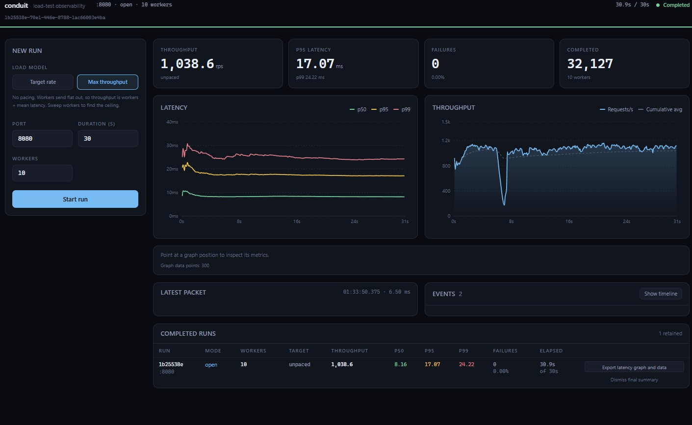
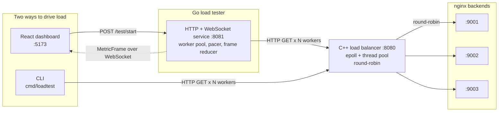

# Conduit

**A Layer 4 TCP load balancer written from scratch in C++, a Go load generator that drives
traffic through it, and a React dashboard that streams the results live.**


Raw POSIX sockets and an `epoll` event loop underneath. No networking libraries, no
load-testing frameworks.



---

## Architecture



### Load balancer (`load-balancer/`)

A Layer 4 TCP proxy on raw POSIX sockets. A non-blocking listener feeds an `epoll` event loop,
which dispatches connection setup and byte forwarding onto a thread pool sized to
`std::thread::hardware_concurrency()`. Each accepted client is paired with a backend chosen
round-robin from a YAML config, and both file descriptors are registered with the same event
loop.

### Load tester (`load-tester/`)

Two load models. In **closed** mode a ticker goroutine fills a token bucket at the requested
rate and N workers pull tokens. In **open** mode there is no ticker and each worker loops flat
out until the context deadline. Workers push outcomes onto a buffered channel drained by one
collector goroutine, keeping aggregation off the request path.

The service (`main.go`, `agent.go`, `test_run.go`) exposes `POST /test/start` and
`GET /test/{id}/stream`. A single-writer `TestRun` reducer folds completions into a snapshot, a
ticker emits a frame every 100 ms, and one terminal frame goes out after the last worker
drains. Requests still in flight when the deadline hits are dropped rather than counted as
target failures, so a run doesn't end with a phantom failure per worker.

The CLI (`cmd/loadtest/`) is the headless path: no streaming, no session state, a sorted
latency slice and a percentile table at exit.

### Dashboard (`dashboard/`)

React 19 + TypeScript + Vite. `hooks/useMetricsStream.ts` owns the WebSocket, `src/state/`
holds frame validation and the reducers behind live observation, the event timeline, and
retained finals, `export/` generates SVG and JSON, and `types/metrics.ts` mirrors the Go wire
contract.

---

## Quick start

> The load balancer uses Linux `epoll`, so it must be built and run on Linux or WSL2. The Go
> tester and the dashboard run anywhere.

**Prerequisites:** Docker (with WSL2 integration on Windows), CMake 3.16+, a C++17 compiler,
`yaml-cpp` (`sudo apt install libyaml-cpp-dev`), Go 1.22+, Node 20+.

### 1. Start the backends

```bash
cd docker
docker-compose up
```

Three `nginx:alpine` containers on `9001`, `9002`, and `9003`, each serving a distinct page
from `dummy-backends/` so you can see which backend answered.

### 2. Build and run the load balancer

```bash
cd load-balancer
cp config.example.yaml config.yaml
cmake -B build && cmake --build build
./build/conduit
```

Listens on `8080` and round-robins across the backends in `config.yaml`.

### 3a. Drive it from the dashboard

```bash
cd load-tester && go run .                   # service on :8081
cd dashboard && npm install && npm run dev   # dashboard on :5173
```

Open `http://localhost:5173`, set mode, rate, and duration, then start a run. The service is a
loopback development tool: no auth, permissive CORS, sessions in memory.

### 3b. Or run it headless

```bash
cd load-tester
go run ./cmd/loadtest -port 8080 -rps 500 -workers 20 -duration 30s
go run ./cmd/loadtest -port 8080 -mode open -workers 50 -duration 30s
```

| Flag | Default | Meaning |
| --- | --- | --- |
| `-port` | `8080` | Port on `127.0.0.1` to target |
| `-mode` | `closed` | `closed` holds a target rate of `-rps`; `open` sends flat out |
| `-rps` | `100` | Requested requests per second (closed mode only) |
| `-workers` | `10` | Concurrent worker goroutines |
| `-duration` | `30s` | How long to run (any Go duration string) |
| `-verbose` | `false` | Print every request. Distorts timings at high rates: the stdout I/O contends with the workers doing the measuring. |

---

## Closed vs open

Closed mode paces requests through a token bucket, so the requested rate is a ceiling. If
workers can't keep up, the bucket drops tokens instead of queueing them, so achieved
throughput falls below the request while latency stays honest.

Open mode has no pacer, so throughput becomes `workers / mean-latency`. Sweep `-workers` to
find where it stops improving.

Throughput numbers should come from open mode. Closed mode cannot report more than you asked
for.

---

## Project structure

```
conduit/
├── load-balancer/          # C++17 L4 TCP load balancer
│   ├── src/main.cpp        # epoll event loop, round-robin, YAML config
│   ├── src/thread_pool.cpp
│   ├── include/thread_pool.hpp
│   ├── config.example.yaml
│   └── CMakeLists.txt
├── load-tester/            # Go module
│   ├── main.go             # REST + WebSocket handlers, session map
│   ├── agent.go            # worker pool, pacing, frame emission
│   ├── test_run.go         # wire types + single-owner TestRun reducer
│   ├── agent_test.go
│   └── cmd/loadtest/       # headless CLI
├── dashboard/              # React + TypeScript + Vite client
│   └── src/
│       ├── components/     # presentational
│       ├── hooks/          # useMetricsStream, owns the WebSocket
│       ├── state/          # frame validation + reducers
│       ├── export/         # SVG and JSON generation
│       └── types/          # mirrors the Go wire contract
├── docker/                 # docker-compose for the nginx backends
├── dummy-backends/         # static HTML served by each backend
└── results/                # raw benchmark output
```

Two `main` packages in one module: the service at `load-tester/` and the CLI at
`load-tester/cmd/loadtest/`. `go run .` starts the service, `go run ./cmd/loadtest` runs the
CLI, `go build ./...` builds both.

ApacheBench output in `results/` predates the current build, so the numbers there aren't a
current performance claim.

---

## Future improvements

- **Non-blocking `connect()` and `write()`.** Both block today, so a slow backend or a stalled
  peer parks a thread-pool worker. Needs `O_NONBLOCK` with `EINPROGRESS`, per-connection output
  buffers, and `EPOLLOUT`, plus edge-triggered reads instead of one 4 KiB `read()` per wakeup.
- **Connection-scoped ownership.** A client and its backend are separate epoll registrations, so
  one thread can be reading a fd while another closes it (`src/main.cpp:97-98`). Refcount the
  connection behind `epoll_event.data.ptr`, or shard per-thread with `SO_REUSEPORT`.
- **Health checking and failover.** Failed backends still receive traffic.
- **Least-connections and weighted routing.** Round-robin only today.
- **Configurable requests in the tester.** `GET /` on `127.0.0.1` only, keep-alives off so every
  request pays TCP setup, and percentiles include warm-up.
