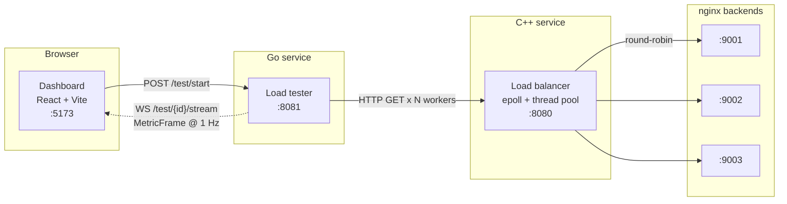

# Conduit

**A Layer 4 TCP load balancer written from scratch in C++, a Go load-testing service, and a React dashboard that streams live latency and throughput while a test runs.**


No networking libraries, no load-testing frameworks, no charting service — raw POSIX sockets
and an `epoll` event loop underneath, a hand-rolled metrics pipeline in the middle, and a
browser reading it live over a WebSocket.


---

## Architecture



**Load balancer** (`load-balancer/`) — a Layer 4 TCP proxy built on raw POSIX sockets. A
non-blocking listener feeds an `epoll` event loop, which dispatches connection setup and
byte forwarding onto a thread pool sized to `std::thread::hardware_concurrency()`. Each
accepted client is paired with a backend chosen round-robin from a YAML config, and both
file descriptors are registered with the same event loop. No `libevent`, no framework.

**Load tester** (`load-tester/`) — a Go service that drives configurable load at an HTTP
target and streams observability data back. Worker goroutines pull from a token-bucket
rate limiter and submit *immutable completion facts* to a single-owner `TestRun` reducer.
Because only the reducer mutates counters, latency samples, the latest packet, and the
pending event queue, a frame can never observe half-written state. It emits one
`MetricFrame` per second plus exactly one terminal frame carrying the whole-test summary.

**Dashboard** (`dashboard/`) — a React + TypeScript client that validates every incoming
frame before it touches state. Live observation is scoped to the active test and resets on
switch; completed-test summaries live in a separate app-shell map so they survive socket
closure and in-app navigation. Reducers are split by concern
(`state/activeObservation.ts`, `state/timeline.ts`, `state/sessionFinals.ts`) and
components stay purely presentational.

---

## Features

- **Live latency and throughput charts** — cumulative p50/p95/p99 and achieved RPS plotted
  against elapsed test time, with a per-datum detail readout on hover
  (`dashboard/src/components/Charts.tsx`).
- **Request/response packet inspector** — the most recent completed request, showing full
  method, URL, headers, and body on both sides, or the failure that replaced the response
  (`dashboard/src/components/PacketView.tsx`).
- **Event timeline** — test lifecycle and failure events, deduplicated on first receipt by
  `event_id` and held in stable ascending timestamp order (`dashboard/src/state/timeline.ts`).
- **Retained final summaries** — every completed test in the browser session keeps its
  summary and an immutable, deep-frozen export snapshot, independent of the live stream
  (`dashboard/src/state/sessionFinals.ts`).
- **One-click export** — generates a standalone SVG latency graph with no JavaScript, no
  external fonts, and no network dependencies, plus the JSON source data behind it
  (`dashboard/src/export/exportFinalSummary.ts`).

---

## Quick start

> The load balancer uses Linux `epoll`, so it must be built and run on Linux or WSL2. The Go
> service and dashboard run anywhere.

**Prerequisites:** Docker (with WSL2 integration on Windows), CMake 3.16+, a C++17 compiler,
`yaml-cpp` (`sudo apt install libyaml-cpp-dev`), Go 1.22+, Node 18+.

### 1. Start the backend servers

```bash
cd docker
docker-compose up
```

Three `nginx:alpine` containers on ports `9001`, `9002`, and `9003`, each serving a distinct
page from `dummy-backends/` so you can see which backend answered.

### 2. Build and run the load balancer

```bash
cd load-balancer
cp config.example.yaml config.yaml
cmake -B build && cmake --build build
./build/conduit
```

Listens on `8080` and round-robins across the backends listed in `config.yaml`.

### 3. Run the load tester

```bash
cd load-tester
go run .
```

Listens on `8081`. Use `go run .` and not `go run main.go` — the package spans three files.

### 4. Run the dashboard

```bash
cd dashboard
npm install
npm run dev
```

Open http://localhost:5173, set **Port** `8080` (the load balancer), pick a duration, target
RPS, and worker count, and hit **Start Test**. Charts fill in once per second; the summary
and export controls appear when the run completes.

---

## API

The Go service exposes two endpoints. The dashboard is one client of them — `curl` and
`websocat` work just as well.

| Method | Path | Purpose |
| --- | --- | --- |
| `POST` | `/test/start` | Start a test. Body `{ "port": 8080, "dur": 30, "rps": 1000, "workers": 10 }` → `{ "test_id": "<uuid>" }` |
| `GET` | `/test/{id}/stream` | Upgrade to a WebSocket and receive `MetricFrame`s until the stream closes. One consumer per test. |

Frames arrive once per second, with a single terminal frame (`done: true`) carrying
`final_summary`:

```jsonc
{
  "test_id": "…",
  "timestamp": "2026-07-30T18:04:11Z",
  "elapsed_seconds": 12,
  "done": false,
  "aggregate": {
    "throughput_rps": 942.7,
    "completed_count": 11312,
    "failed_count": 0,
    "p50_ms": 1.8, "p95_ms": 7.4, "p99_ms": 19.2
  },
  "request_response_record": {
    "completed_at": "2026-07-30T18:04:10Z",
    "ping_ms": 1.6,
    "request":  { "method": "GET", "target_url": "http://localhost:8080", "headers": {}, "body": "" },
    "response": { "status_code": 200, "headers": {}, "body": "…" }
    // …or "failure": "<non-empty reason>" instead of "response"
  },
  "events": [ { "event_id": "…", "type": "test-started", "message": "Test started." } ],
  "agents": [],
  "backend_health": []
}
```

Wire types are defined in `load-tester/test_run.go` and mirrored exactly in
`dashboard/src/types/metrics.ts`.

---

## Project structure

```
conduit/
├── load-balancer/          # C++17 L4 TCP load balancer
│   ├── src/main.cpp        # epoll event loop, round-robin, YAML config
│   ├── src/thread_pool.cpp
│   ├── include/thread_pool.hpp
│   ├── config.example.yaml
│   └── CMakeLists.txt
├── load-tester/            # Go load-testing service
│   ├── main.go             # REST + WebSocket handlers, session map
│   ├── agent.go            # worker pool, rate limiting, request execution
│   ├── test_run.go         # wire types + single-owner TestRun reducer
│   └── agent_test.go
├── dashboard/              # React + TypeScript + Vite client
│   └── src/
│       ├── components/     # Charts, PacketView, Timeline, FinalSummary, TestConfig
│       ├── hooks/          # useMetricsStream — owns the socket only
│       ├── state/          # activeObservation, timeline, sessionFinals reducers
│       ├── export/         # standalone SVG + JSON export
│       └── types/          # wire contract mirroring the Go types
├── docker/                 # docker-compose for the nginx backend fleet
├── dummy-backends/         # static HTML served by each backend
└── results/                # raw ApacheBench output
```

---

## Testing

```bash
cd load-tester && go test ./...          # request-execution outcome capture
cd dashboard   && npm run lint           # ESLint
cd dashboard   && npm run build          # type-check + production build
```

Dashboard property and component tests are specified but not yet written — the reducers were
designed against a set of numbered correctness properties, and encoding those as
`fast-check` properties is outstanding work.

---

## Benchmarking

The load balancer has been benchmarked with ApacheBench across concurrency levels from 1 to
1000 against the three-backend nginx fleet:

```bash
ab -n 10000 -c <N> http://localhost:8080/
```

Raw output lives in `results/`. **These runs predate the current build**, so treat the
numbers as historical rather than a current performance claim — re-benchmarking against the
present load balancer is on the roadmap.

---

## Known limitations

Deliberate scope cuts and known weak points, kept here rather than hidden:

**Load balancer**

- **Blocking `connect()`** — a slow backend parks a worker thread and can exhaust the pool
  under load. Fix: `O_NONBLOCK` plus `EINPROGRESS` handling.
- **Global mutex** — all threads contend on one lock per read/write. Fix: per-thread `epoll`
  instances, eliminating the sharing entirely.
- **Unchecked `write()`** — short writes silently drop bytes. Fix: loop until all bytes are
  sent, or buffer partial writes.
- **Single `accept()` per wakeup** — leaves connections queued under bursts. Fix: loop until
  `EAGAIN`.
- **No health checking** — failed backends still receive traffic.
- **Round-robin only** — no awareness of backend load.

**Load tester**

- Sends `GET` to the root path on `localhost` only; no method, path, header, or body
  configuration yet.
- Keep-alives are disabled, so every request opens a fresh TCP connection. This measures
  connection setup as well as service time — intentional for exercising the load balancer,
  but not representative of a keep-alive client.
- Full request and response bodies are held in memory and streamed to the browser with no
  size cap or redaction.
- CORS is `*` and the WebSocket origin check always passes. Both are dev-only and must not
  be deployed as-is.

---

## Roadmap

- [x] Basic TCP proxy (single backend)
- [x] Round-robin routing across multiple backends
- [x] `epoll` event loop with non-blocking I/O
- [x] Thread pool for concurrent connection handling
- [ ] Health checking and automatic failover
- [ ] Least-connections and weighted routing
- [x] Go load-testing agent
- [ ] Distributed coordinator with gRPC metric aggregation across multiple agents
- [x] Live dashboard with WebSocket metric streaming
- [ ] Re-benchmark the current build and publish results
